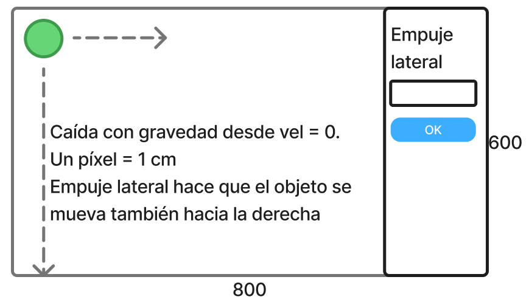

# Práctico 1 - Gravedad y gráficos

El objetivo de este práctico es familiarizarse con el patrón
de diseño observer. Este patrón de diseño es la mejor forma
conocida para notificar de cambios en objetos, esto sin que
se relacionen los objetos observados y los observadores.

## Estructura del programa

El programa debe tener las siguientes clases:

* GravedadFrame: esta clase contiene la ventana de nuestra
  aplicación. Esta ventana debe acomodarse al tamaño del
  panel interno que contiene. Esta ventana tiene además un panel
  a la derecha que tiene un campo para colocar un número y
  un botón para comenzar la animación.
* GravedadPanel: esta clase es el panel que se encuentra dentro
  de la ventana. El tamaño de este panel es de 800x600 píxeles.
* Pelota: esta clase representa una pelota que se ve en la pantalla
  como un círculo de radio 30 píxeles. La posición inicial de
  esta pelota es la posición del centro en (30,30)

A continuación se puede ver un prototipo:

## Reglas de ejecución

Cuando el programa se ejecuta aparece el panel vacío con la
pelota en su lugar inicial. El espacio del panel está simulando
un espacio real donde cada pixel es un centímetro en la vida
real.

La idea es simular lo más perfectamente posible la caída de
una pelota desde una altura de 6 metros.

Cuando se coloca OK en el panel de la derecha la pelota
comienza a caer hasta el piso. Si es que se colocó un número
en el panel de la derecha entonces la pelota también se mueve
hacia la derecha con la velocidad indicada.

La pelota tiene un coeficiente de rebote. El objetivo es que de
varios botes hasta que se pare o hasta que salga de la pantalla.
No puede salir por abajo porque se supone que la base (pixel 600)
es el piso.

## Multiprocesos

En el práctico debe implementar multiprocesos para que
se muestre la animación de la pelota. En el proceso de
animación de la pelota se debe colocar que se dibuja la
pelota cada X tiempo. Ese tiempo debe ser de 50 ms. En

## Matemáticas

Nuestro problema es que tenemos una velocidad inicial
$v_0$ y una posición inicial $p_0 = (x_0, y_0)$. Tenemos
que averiguar la nueva velocidad $v_1$ y la nueva posición
$p_1 = (x_1, y_1)$ luego de 50 ms.

Cálculo de la nueva velocidad $v$ en el eje $y$:

$$v_1 = v_0 + g \dot \Delta t$$

Cálculo de la nueva posición $p_1$ en el eje $y$:

$$y_1 = y_0  + v_0\dot \Delta t + \frac 1 2 g \dot (\Delta t)^2$$

Donde:

$$g = 9.81 \frac{m}{s^2}$$

$$\Delta t = 0.05 s$$

La velocidad en $x$ se mantiene constante y la posición en
ese eje se puede averiguar muy fácilmente con la velocidad.

## Fecha de entrega

La fecha de entrega del práctico es el 28 de marzo de 2025.